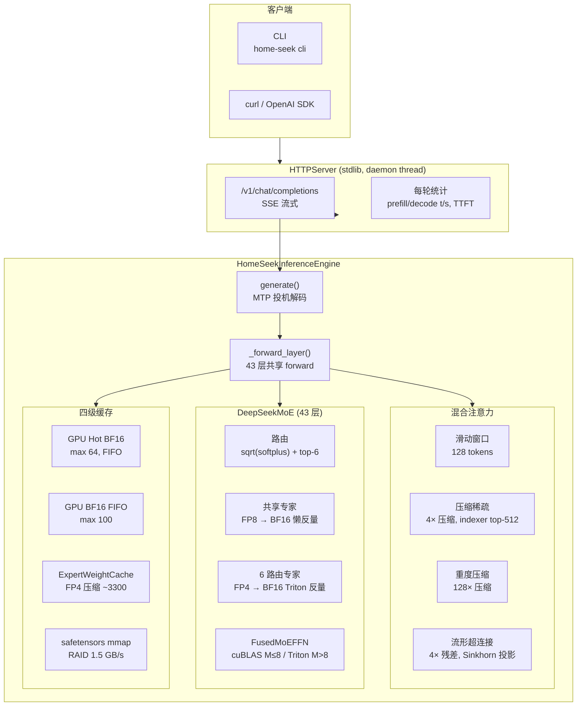
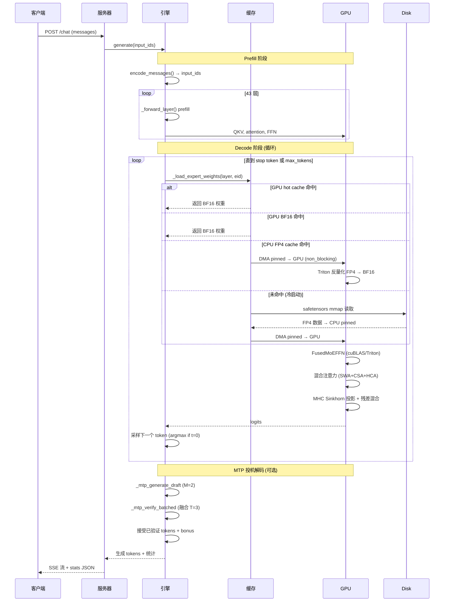
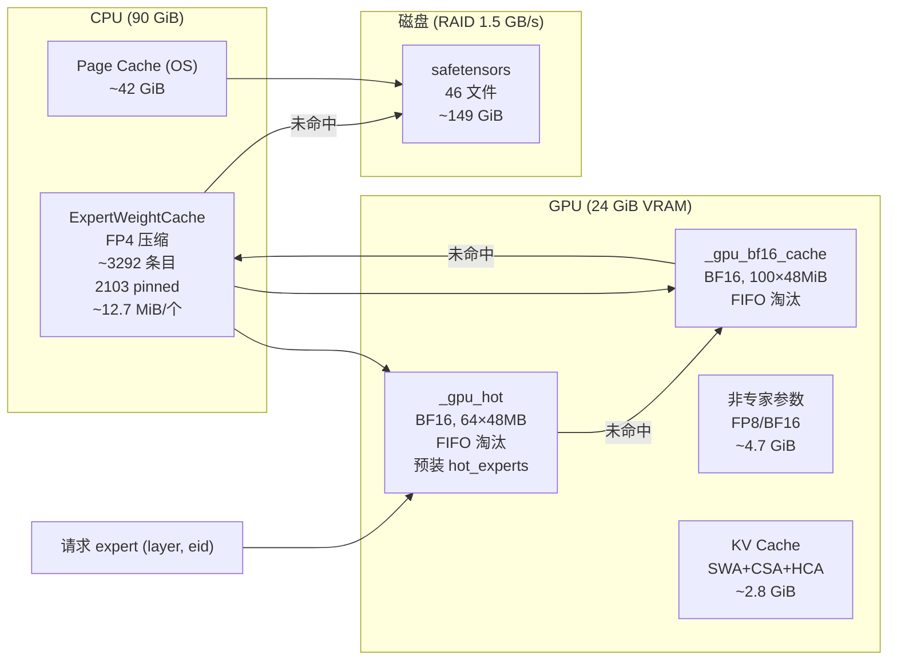

# Home-Seek

**单卡/多卡 RTX 4090 推理 DeepSeek-V4-Flash (284B MoE)，自动多 GPU 适配**

[](LICENSE)

> **[English Version](README_EN.md)** · [安装](#安装) · [快速开始](#快速开始) · [架构](#架构总览) · [性能](#性能) · [有效优化](#有效优化-) · [无效优化](#无效优化-)

---

## 项目简介

Home-Seek 在 **单张 NVIDIA RTX 4090 (24 GiB VRAM)** 上运行 DeepSeek-V4-Flash — 284B 总参数 (13B 激活)、原生支持百万 token 上下文的 MoE 模型。通过四级缓存体系、Triton 自定义 kernel、MTP 投机解码等优化, 实现可用推理服务。

| 指标 | 数值 |
|:---|---:|
| Decode (warm, 单 prompt) | **1.60 t/s** |
| Decode (warm, 多 prompt) | **1.55 t/s** |
| Prefill (warm, 5-8 tok) | **~2.0 t/s** |
| 峰值显存 (PyTorch) | **~19.9 GiB** |
| 峰值显存 (nvtop 实际) | **~23 GiB** |
| CPU cache | ~42 GiB FP4 pinned |
| MTP eager (上限) | 5.96 t/s |
| MTP verified | 1.38 t/s |

[](https://asciinema.org/a/Cui1LDvCnfNQ6A51)

---

## 架构总览



### 推理时序



---

## 缓存体系



键值: `(layer, eid)` | 每专家: `I×D×51/32 ≈ 12.75 MiB` (FP4 data + f8 scale, 含 scale 约 12.7 MiB)

---

## 模型权重与内存 / Model Weights & Memory

### 权重总量

| 类型 | 大小 | 占总量 | 精度 | 说明 |
|:---|---:|---:|:---|:---|
| **路由专家** (43×256 组 w1/w2/w3) | *137 GiB* | 92% | FP4 int8 + f8 scale | 每专家 ~12.7 MiB，推理时反量到 BF16 (48 MiB) |
| **注意力 QKV/Wo** | 4.5 GiB | 3% | FP8 e4m3 | 每层 17 个 tensor: wq_a/b, wkv, wo_a/b, compressor, indexer |
| **共享专家** (43 层 × 3 权重) | 1.0 GiB | 0.7% | FP8 e4m3 | GPU 常驻，懒反量到 BF16 |
| **Embed + lm_head** (不共享) | 2.0 GiB | 1.3% | BF16 | embed.weight + head.weight, 各 `[129280, 4096]` |
| **MTP 专家** (256 个) | 3.2 GiB | 2.1% | FP4 int8 + f8 scale | CPU pinned, 同主模型格式 |
| **MTP 非专家权重** (33 个 tensor) | 0.14 GiB | 0.1% | FP8 e4m3 + BF16 | attn QKV/Wo, e_proj, h_proj, norms, MHC 等 |
| **FFN gate** | 0.09 GiB | 0.06% | BF16 | gate.weight `[256,4096]` × 43 层 |
| **Hash routing** (tid2eid) + MHC + norms 等 | 0.09 GiB | 0.06% | 混合 | tid2eid int64, MHC float32, norms BF16 |
| **总计** | **~149 GiB** | 100% | — | 46 个 safetensors 文件 |

### 各层非专家权重 (每层 118 MB)

| 组件 | 大小 | 包含 |
|:---|---:|:---|
| Attention QKV + Wo 投影 | 108.6 MB | wq_a/b, wkv, wo_a/b, q_norm, kv_norm, attn_sink |
| FFN gate + bias | 9.9 MB | gate.weight (BF16 `[256,4096]`), bias, tid2eid |
| Compressor (CSA/HCA) | 部分计入 attention | wkv, wgate, norm, ape (位置编码) |
| Indexer + compressor | 部分计入 attention | wq_b, weights_proj, wkv, wgate, norm, ape |
| MHC (全局加载) | 不计入每层 | hc_head_fn/base/scale (3 个 tensor) |
| Norms (全局加载) | 不计入每层 | norm.weight 等 |

### 运行时内存分布

```
GPU (24 GiB VRAM)
├── 非专家权重 (QKV/Wo/gate/norm/MHC)  ≈ 4.7 GiB  ← 常驻
├── 共享专家 (43 层 FP8 → BF16 懒反量) ≈ 0.9 GiB  ← 常驻
├── GPU 热专家缓存 (max 64 × 48 MiB (BF16 deq)) ≈ 2.8 GiB ← FIFO
├── GPU BF16 FIFO 缓存 (max 100 × 48 MiB) ≈ 4.2 GiB
├── KV 缓存活跃窗口 (32K tok)           ≈ 1.3 GiB  ← 随上下文增长
├── MTP 非专家权重                      ≈ 0.3 GiB  ← 常驻
├── CUDA context + 其他                  ≈ 1.9 GiB
└── CUDA context + Triton cache + 碎片        ≈ 2.9 GiB  ← nvtop 可见但 PyTorch 不统计
   总计 (PyTorch 统计)       ≈ 19.9 GiB
   总计 (nvtop 实际占用)     ≈ 23.0 GB

CPU (90 GiB RAM)
├── ExpertWeightCache FP4 (3292 条目)    ≈ 41 GiB  ← 2103 pinned + 1189 LRU
├── OS page cache (safetensors mmap)     ≈ 42 GiB  ← 内核管理
├── KV cache CPU 归档 (长上下文)          ≤ 34 GiB  ← 超出 32K 窗口的部分
└── 系统预留                               8 GB
```

### 上下文长度支持

| 因素 | 上限 | 限制原因 |
|:---|---:|:---|
| **RoPE 理论** | **1,048,576** | `max_position_embeddings`，YaRN 缩放因子 16× |
| **GPU 活跃窗口** | **32,768** | `LayerState.active_window=32768` (`layer_state.py:7`)，超出自动 CPU offload |
| **CPU 归档容量** | **~860,000** | 34 GiB 可用 / 43 KB/tok (kv_latent 512×BF16 ×43 层) |
| **实际总支持** | **~900,000** | 32K GPU + 860K CPU，受 90 GiB RAM 限制 |

长上下文下显存与时间开销（估算）：

| 上下文长度 | GPU KV 缓存 | CPU KV 归档 | Prefill 预估耗时 |
|:---|---:|---:|---:|
| 4K | 0.2 GiB | 0 GiB | ~10s |
| 32K | 1.3 GiB | 0 GiB | ~80s |
| 128K | 1.3 GiB | 3.8 GiB | ~5 min |
| 512K | 1.3 GiB | 19.2 GiB | ~20 min |
| 1M | 1.3 GiB | 38.4 GiB | ~40 min |

Prefill 是 43 层全序列前向。得益于混合注意力设计（SWA 线性 + CSA 稀疏 top-k + HCA 128× 压缩），实际注意力复杂度远低于 O(T²)。与 decode 不同，prefill 时 T 个 token 的 FFN 是批量处理的：每个 unique expert 只加载一次，所有路由到它的 token 共享一次 matmul（`_forward_ffn` 第 1101 行 → `_fused_moe.forward`）。所以 expert 加载总次数为 O(layers × n_routed_experts) ≈ 11K，不随 T 增长。主要耗时在 43 层串行前向和 QKV/Wo 大 GEMM。32K 内体验尚可，128K+ 需分钟级等待。

> 注：上表 prefill 耗时未包含 QKV/Wo 投影和 expert 加载开销，仅作参考。

---

## 性能

### 基线 (temperature=0, max-tokens=20, R2-R5 warm avg)

| 模式 | Prefill t/s | Decode t/s | vs 1.54 | 条件 |
|:---|:---:|---:|:---|---:|
| No MTP 单 prompt | 1.0 | 1.60 | — | "Hello" ×5 轮 |
| No MTP 多 prompt | ~2.0 | 1.54 | — | 5 个不同 prompts |
| **GQA fusion** | ~2.0 | **1.57** | **+2%** | `--use-gqa-fusion`, 噪声内 |
| MTP eager (跳过验证) | ~2.0 | 5.96 | +287% | 上限, 不用于生产 |
| **MTP verified** | ~2.0 | **1.38** | **−10%** | M=2, KV cache + 融合验证 |
| MTP verified (旧) | ~2.0 | 0.96 | −38% | M=4, 无 KV cache, 两阶段验证

### 瓶颈排序 (warm decode, R2-R5 avg, 占层时间比例)

| # | 瓶颈 | 每 token 耗时 | 占层时间 | 状态 |
|:---|---:|---:|---:|:---|
| 1 | **FFN 层** (DMA + dequant + matmul) | ~430ms | 69% | ⚠ 大 GEMM 主导 |
| 2 | **Attention 层** (QKV proj + attn + compress) | ~190ms | 31% | ⚠ 其中文件 I/O ~90ms 已大幅降低 |
| | 层时间合计 | ~620ms | 100% | |
| | **Python dispatch** (层外) | ~40ms | — | ⚠ 下一目标 (CUDA graph partial) |
| | **MTP 接受率** | — | — | ⚠ ~38%, 需 ~60% 才能打平 |

---

## 有效优化 ✅

| 优化 | 收益 | 说明 |
|:---|---:|:---|
| **CPU pinned memory** | +26% | 引擎初始化时对 CPU FP4 条目调用 `.pin_memory()`, 消除 DMA 退化为同步拷贝。最大单项收益 |
| **FusedMoEFFN cuBLAS M≤8** | +1.9% | M≤8 时 Triton 15/16 SM 空转, cuBLAS 快 8× (`fused_moe.py:297`) |
| **CPU cache ↔ page cache 平衡** | 消除冷启动 | `min(RAM/2, total_exp)` ≈ 42 GiB cache + 45 GB page cache, 不挤占 OS |
| **f8 scale 保持 float8_e8m0fnu** | 4× 内存节省 | `_make_raw_entry` 不转 fp32, 12.7 MiB/专家 (vs 30 MB if fp32) |
| **逐层热专家检测** | 提高命中率 | `_all_routed_are_hot` 替代全局集, 更准确的热覆盖 |
| **热专家预装** | 减少冷 miss | 启动时从 `hot_experts.json` 预装每层 hot 到 GPU FIFO |
| **MTP argmax (t=0)** | 稳定接受率 | temperature=0 时 draft 也 argmax, 消除随机噪声 |
| **MTP KV cache + 融合验证** | +44% (0.96→1.38) | 跨步注意力 KV cache + torch.cat 单次 forward |
| **四级缓存体系** | 核心架构 | CPU FP4 LRU + GPU hot FIFO + GPU BF16 FIFO + page cache, 单卡跑 284B 成可能 |
| **HardwareConfig** | 多硬件适配 | 参数集中管理, 6 种预设策略 (`4090`/`a100`/`h20`/`rtx pro 6000`/`2080`/fallback), 自动多卡 device_map |
| **KV cache CPU offload** | 支持长上下文 | 显存超阈值时自动将旧 KV 移出 GPU, 阈值由 `HardwareConfig.kv_offload_threshold_gb` 控制 |

---

## 无效优化 ❌

| 优化 | 尝试原因 | 失败原因 | 结论 |
|:---|---|:---|---|
| **GQA Attention fusion** (`--use-gqa-fusion`) | 消除 64× KV expand, 节省 HBM | Attention matmul 仅占 `_forward_attn` <5%; 热点是 QKV/Wo projection 的大 GEMM | **无吞吐提升** (1.60→1.57, 在噪声内)。默认关闭 |
| **MTP verified** (M=2) | 投机解码加速 | 接受率 ~38%, 需 ~60% 才能抵消 43 层验证。1 层 MTP vs 43 层主模型差距 | **慢于 no-MTP** (1.38 vs 1.51)。权重重用原理有效, 但 draft 质量不足 |
| **CPU 全量预载** | 消除所有文件 I/O | 11008×12.7 MiB = 169 GB 挤占 page cache, 推理 +8% | **退化为平衡策略** ~42 GiB |
| **Async DMA prefetch** | 重叠 DMA + compute | CUDA stream 管理开销 > 收益; FP4 dequant 0.04ms vs DMA 0.8ms 无可重叠 | **禁用**, 代码移入 scripts/ |
| **GPU FP4 store** (旧架构) | GPU 缓存 FP4 专家 | 与 CPU ExpertWeightCache 同键同容量同 LRU, 命中率 ~0% | **移除** |
| **共享专家 cuBLAS fusion** | FP32 累加序一致 | cuBLAS vs Triton 累加序差异 → 路由噪声 ±20% | **不可用于 A/B 对比** |
| **MHC_post Triton kernel** | 替代 PyTorch fallback | 始终 AssertionError | **走 PyTorch fallback** |
| **ExpertCacheManager** (expert_cache.py) | 统一四层缓存抽象 | engine.py 自建重复缓存, 未接入 | **半成品**, 统计指向空缓存 |
| **异步专家预测** (`predictor.predict`) | 用 hidden state 预测下一层专家提前加载 | `predictor.collect()` 在记录数据但 `predict()` 从未被调用 | **dead code**, 只收集不消费 |
| **同层 DMA∥compute 流水线** | 重叠 expert DMA + 当前层计算 | FP4 dequant 0.04ms vs DMA 0.8ms, 粒度不匹配无法重叠 | **不适用** |

---

## 关键设计决策

### 为什么 MTP verified 不加速？

```
MTP Eager (跳过验证): 1 次主 fwd → 生成 2 drafts → 全接受 = 3 tok/步 → 5.96 t/s
MTP Verified:         1 次主 fwd → 生成 2 drafts → 验证 (43 层 fwd) → 接受 ~0.76 tok → 1.38 t/s
```

验证需要一次完整 43 层前向。接受率 ~38% 不够高, 验证开销超过 draft 收益。根本限制是 1 层 MTP 模块与 43 层主模型之间的能力差距。

### 为什么 GQA fusion 不加速？

| 操作 | 占比 | FLOPs |
|:---|---:|---:|
| QKV projection (3× GEMM) | ~50% | wq_a `[1024,4096]`, wq_b `[32768,1024]`, wkv `[512,4096]` |
| Wo projection (2× GEMM) | ~25% | wo_a `[1024,4096]`, wo_b `[4096,8192]` |
| KV compress + 其他 | ~23% | compressor, RoPE, indexer |
| **Attention matmul** (优化目标) | **~2%** | SDPA `[64,1,512] @ [512,T_kv]` — 可忽略 |

### Roofline 分析

```
M=1 decode matmul: [1,4096] × [16384,4096]
  算术强度 = FLOPs / bytes = 2×M×K×N / (K×N×2B) = M/2

M=1:  算术强度 = 1.0  → HBM 上限 = 847 GB/s × 1.0 = 0.85 TFLOPS ✓
M=64: 算术强度 = 67   → HBM 上限 = 57 TFLOPS
```

M=1 decode 的 matmul 受 HBM 带宽限制, 与 GPU 算力无关。增加显存可减少 DMA/IO（更大 GPU 缓存），但 decode 速度的关键瓶颈是 HBM 带宽。

### 硬件升级性价比

| 方案 | 成本 | 收益 | 关键参数 | 说明 |
|:---|---:|---:|:---|:---|
| **第二张 4090** (流水线) | ~$1,800 | **~2× 吞吐** | VRAM: 24+24 GiB | 43 层分半各跑 22 层，管道并行。每卡只缓存半层专家 → 命中率提升 + 额外收益。PCIe P2P <1ms |
| **RTX 5090** | ~$2,000 | **~+60%** | VRAM: 32 GB, BW: ~1.8 TB/s | HBM 带宽提升 ~1.8× 直接加速带宽受限的 M=1 decode。32GB 可缓存 ~330 专家 (vs 164)，大幅减少 DMA。Compute ~2× 加速 prefill 和 MTP verify |
| **RTX A6000** (48 GB) | ~$5,000 | **~+15%** | VRAM: 48 GB, BW: 768 GB/s | 带宽反而低于 4090 (768 vs 1008 GB/s)。48GB 可缓存 500+ 专家 → DMA+IO 大幅降低，但带宽受限操作更慢，两者部分抵消 |
| **CPU 升级** (更高内存带宽) | ~$500 | **~+5%** | DDR5 带宽 | DMA 吞吐受 CPU 内存控制器限制，更快 DDR5 可略微提升 pinned→GPU |
| **PCIe 5.0** | ~$1,000 | **~+3%** | 16→32 GB/s | 每 expert 传输仅 12.7 MiB，带宽翻倍收益被小粒度掩盖 |
| 本地 NVMe 专享 | N/A | — | 已用 NVMe RAID | 1.7T ×3，权重 150GB 已全在 NVMe 上 |

---

## 安装

```bash
# 下载权重 (~150GB)
python -m home_seek download
# 或: huggingface-cli download QingGo/Home-Seek --local-dir weights

# 从源码安装
git clone https://github.com/QingGo/home-seek.git
cd home-seek
make install
```

## 快速开始

```bash
# 启动服务器
make server

# 交互式 CLI (另一个终端)
make cli

# OpenAI 兼容 API
curl http://localhost:8000/v1/chat/completions \
  -H "Content-Type: application/json" \
  -d '{"messages":[{"role":"user","content":"Hello"}],"max_tokens":50,"temperature":0}'

# 性能分析
make profile

# 多轮 profiling
uv run python -m home_seek.profiling_runner --rounds 5 \
  --prompts "Hello" "What is AI?" "Write a poem" "How are you?" "Hi" \
  --max-tokens 20 --temperature 0
```

### CLI 命令
- `/think` — 切换思考模式
- `/stats` — 显示上一轮统计
- `/help` — 帮助
- `/quit` — 退出

### API 响应统计
```json
{
  "stats": {
    "encoding_tokens": 5, "encoding_time_ms": 3040, "encoding_speed_tps": 1.6,
    "ttft_ms": 3040,
    "generated_tokens": 12, "decode_time_ms": 7810, "decode_speed_tps": 1.54
  }
}
```

---

## 系统要求

- **GPU**: NVIDIA RTX 4090 (24 GiB VRAM), CUDA 12+
- **RAM**: 90+ GB (容器)
- **磁盘**: 150 GB (模型权重)
- **OS**: Linux

---

## 项目结构

```
src/home_seek/
├── __main__.py                # CLI entry: download/server/cli
├── api_server.py              # HTTP server (stdlib, daemon thread)
├── inference_engine/          # 推理引擎包
│   ├── engine.py              # HomeSeekInferenceEngine
│   ├── weight_loader.py       # WeightLoader + FP4/FP8 加载
│   ├── layer_state.py         # LayerState (逐层 KV 状态)
│   └── expert_cache.py        # ExpertWeightCache + ExpertCacheManager
├── fused_moe.py               # FusedMoEFFN + SharedExpertFFN (Triton + cuBLAS)
├── gqa_attention.py           # [实验性] GQA 融合注意力 kernel
├── router.py                  # MoE 路由 (sqrt(softplus)+topk)
├── compressor.py              # KV 压缩 (CSA/HCA)
├── hybrid_kv_cache.py         # Hybrid KV Cache (SWA+CSA+HCA)
├── lightning_indexer.py       # Lightning Attention indexer
├── mhc.py                     # MHC Sinkhorn split
├── model_config.py            # @dataclass 配置
├── _fp4.py                    # FP4 量化/反量化参考实现
├── profiling_runner.py        # 性能分析入口
├── expert_predictor.py        # 专家预测 (HeuristicPredictor)
├── hw_profile.py              # 硬件性能探测
├── hardware_config.py         # HardwareConfig — 所有硬件参数集中管理
└── encoding_dsv4.py           # 消息编码 (DeepSeek V4 格式)

tests/
├── conftest.py                # Triton 预热 + CUDA skip
├── _reference.py              # 测试参考实现
├── _engine_stub.py            # EngineStub 统一构造
├── test_fixes.py, test_fp4_experts.py, test_mtp.py, ...
└── integration/
    └── test_inference_e2e.py  # 端到端回归测试
```

---

## 设计纪律

1. **修 bug 先写 L1 测试**: L1 测试需 <1 秒, 能准确定位复现 bug
2. **`make profile` 验证性能改动**: `--temperature 0` 消除路由噪声, 3+ 次取平均
3. **`make lint test-unit` 通过再提交**: ruff 静态检查 + 单元测试
4. **改 Triton kernel 后清 cache**: `rm -rf ~/.triton/cache/`
5. **`_forward_layer` 共享方法**: 所有层 forward 走此方法, 不复制粘贴

---

## License

MIT
