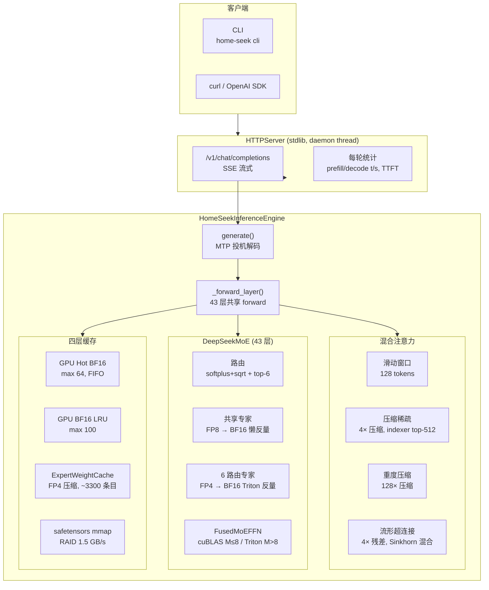
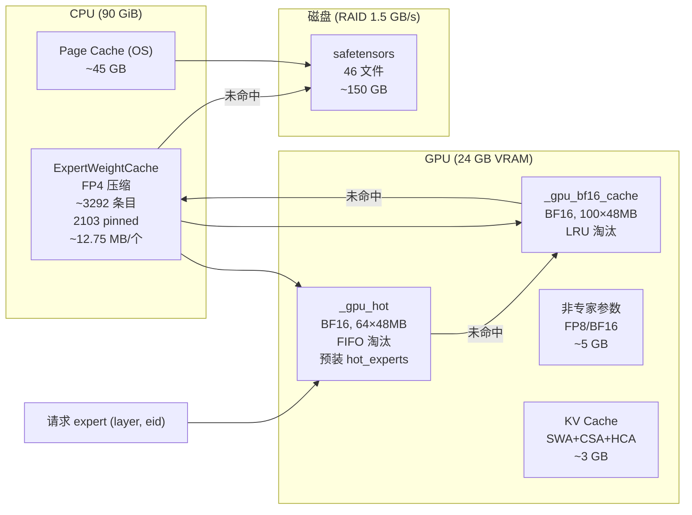

# Home-Seek

**单卡 RTX 4090 推理 DeepSeek-V4-Flash (284B MoE)**

[](LICENSE)

> **[English Version](README_EN.md)** · [安装](#安装) · [快速开始](#快速开始) · [架构](#架构总览) · [性能](#性能) · [有效优化](#有效优化-) · [无效优化](#无效优化-)

---

## 项目简介

Home-Seek 在 **单张 NVIDIA RTX 4090 (24 GB VRAM)** 上运行 DeepSeek-V4-Flash — 284B 总参数 (13B 激活)、原生支持百万 token 上下文的 MoE 模型。通过 FP4 量化、三级缓存体系、Triton 自定义 kernel、MTP 投机解码等优化, 实现可用推理服务。

| 指标 | 数值 |
|:---|---:|
| Decode (warm, 单 prompt) | **1.60 t/s** |
| Decode (warm, 多 prompt) | **1.55 t/s** |
| Prefill (warm, 5-8 tok) | **~2.0 t/s** |
| TTFT (warm) | **~3.4 s** |
| 峰值显存 | **19.9 GB** |
| CPU cache | ~45 GB FP4 pinned |
| MTP eager (上限) | 5.96 t/s |
| MTP verified | 1.38 t/s |

[](https://asciinema.org/a/Cui1LDvCnfNQ6A51)

---

## 架构总览



### 推理时序


---

## 缓存体系



键值: `(layer, eid)` | 每专家: `I×D×51/32 ≈ 12.75 MB` (FP4 data + f8 scale)

---

## 性能

### 基线 (temperature=0, max-tokens=20, R2-R5 warm avg)

| 模式 | Prefill t/s | Decode t/s | vs 1.54 | 条件 |
|:---|:---:|---:|:---|---:|
| No MTP 单 prompt | 1.0 | 1.60 | — | "Hello" ×5 轮 |
| No MTP 多 prompt | ~2.0 | 1.54 | — | 5 个不同 prompts |
| **GQA fusion** | ~2.0 | **1.57** | **+2%** | `--use-gqa-fusion`, 噪声内 |
| MTP eager (跳过验证) | ~2.0 | 5.96 | +287% | 上限, 不用于生产 |
| **MTP verified** | ~2.0 | **1.38** | **−10%** | M=2, KV cache + 融合验证 |
| MTP verified (旧) | ~2.0 | 0.96 | −38% | M=4, 无 KV cache, 两阶段验证

### 瓶颈排序 (warm decode, R2-R5 avg)

| # | 瓶颈 | 每 token 耗时 | 占比 | 状态 |
|:---|---:|---:|---:|:---|
| 1 | **FFN 层** (DMA + dequant + matmul) | ~430ms | 69% | ⚠ 含文件 I/O |
| 2 | **Attention 层** (QKV proj + attn + compress) | ~190ms | 30% | ⚠ 大 GEMM 主导 |
| 3 | 其中: **文件 I/O** (page cache) | ~90ms | 14% | ⬇ 已大幅降低 (冷 4.5ms→温 1.0ms/load) |
| 4 | **MTP 接受率** | — | — | ⚠ ~38%, 需 ~60% 才能打平 |
| 5 | **Python dispatch** | ~40ms | 6% | ⚠ 下一目标 (CUDA graph partial) |

---

## 有效优化 ✅

| 优化 | 收益 | 说明 |
|:---|---:|:---|
| **CPU pinned memory** | +26% | 引擎初始化时对 CPU FP4 条目调用 `.pin_memory()`, 消除 DMA 退化为同步拷贝。最大单项收益 |
| **FP4 量化** | — | 路由专家 FP4 (E2M1), 12.75 MB/专家 vs 48MB BF16, 4× 内存节省 |
| **FusedMoEFFN cuBLAS M≤8** | +1.9% | M≤8 时 Triton 15/16 SM 空转, cuBLAS 快 8× (`fused_moe.py:297`) |
| **CPU cache ↔ page cache 平衡** | 消除冷启动 | `min(RAM/2, total_exp)` ≈ 45 GB cache + 45 GB page cache, 不挤占 OS |
| **f8 scale 保持 float8_e8m0fnu** | 4× 内存节省 | `_make_raw_entry` 不转 fp32, 12.75 MB/专家 (vs 30 MB if fp32) |
| **逐层热专家检测** | 提高命中率 | `_all_routed_are_hot` 替代全局集, 更准确的热覆盖 |
| **热专家预装** | 减少冷 miss | 启动时从 `hot_experts.json` 预装每层 hot 到 GPU FIFO |
| **MTP argmax (t=0)** | 稳定接受率 | temperature=0 时 draft 也 argmax, 消除随机噪声 |
| **MTP KV cache + 融合验证** | +44% (0.96→1.38) | 跨步注意力 KV cache + torch.cat 单次 forward |
| **线程安全 ExpertWeightCache** | 多线程稳定 | `put()` 包装 KeyError 处理并发 eviction |
| **MTP expert scale float32** | 修复接受率 0% | Triton dequantize 不支持 float8_e8m0fnu |
| **Stop token 检测** | 防止垃圾输出 | 从 tokenizer.json 读取真正的 `</｜end▁of▁sentence｜>` token 1 |

---

## 无效优化 ❌

| 优化 | 尝试原因 | 失败原因 | 结论 |
|:---|---|:---|---|
| **GQA Attention fusion** (`--use-gqa-fusion`) | 消除 64× KV expand, 节省 HBM | Attention matmul 仅占 `_forward_attn` <5%; 热点是 QKV/Wo projection 的大 GEMM | **无吞吐提升** (1.60→1.57, 在噪声内)。默认关闭 |
| **MTP verified** (M=2) | 投机解码加速 | 接受率 ~38%, 需 ~60% 才能抵消 43 层验证。1 层 MTP vs 43 层主模型差距 | **慢于 no-MTP** (1.38 vs 1.51)。权重重用原理有效, 但 draft 质量不足 |
| **CPU 全量预载** | 消除所有文件 I/O | 11008×12.75 MB = 169 GB 挤占 page cache, 推理 +8% | **退化为平衡策略** ~45 GB |
| **Async DMA prefetch** | 重叠 DMA + compute | CUDA stream 管理开销 > 收益; FP4 dequant 0.04ms vs DMA 0.8ms 无可重叠 | **禁用**, 代码移入 scripts/ |
| **GPU FP4 store** (旧架构) | GPU 缓存 FP4 专家 | 与 CPU ExpertWeightCache 同键同容量同 LRU, 命中率 ~0% | **移除** |
| **共享专家 cuBLAS fusion** | FP32 累加序一致 | cuBLAS vs Triton 累加序差异 → 路由噪声 ±20% | **不可用于 A/B 对比** |
| **MHC_post Triton kernel** | 替代 PyTorch fallback | 始终 AssertionError | **走 PyTorch fallback** |
| **ExpertCacheManager** (expert_cache.py) | 统一四层缓存抽象 | engine.py 自建重复缓存, 未接入 | **半成品**, 统计指向空缓存 |
| **mypy 类型检查** | 类型安全 | 项目未安装 mypy | **已废弃** `make typecheck` |

---

## 关键设计决策

### 为什么 MTP verified 不加速？

```
MTP Eager (跳过验证): 1 次主 fwd → 生成 2 drafts → 全接受 = 3 tok/步 → 5.96 t/s
MTP Verified:         1 次主 fwd → 生成 2 drafts → 验证 (43 层 fwd) → 接受 ~0.76 tok → 1.38 t/s
```

验证需要一次完整 43 层前向。接受率 ~38% 不够高, 验证开销超过 draft 收益。根本限制是 1 层 MTP 模块与 43 层主模型之间的能力差距。

### 为什么 GQA fusion 不加速？

| 操作 | 占比 | FLOPs |
|:---|---:|---:|
| QKV projection (3× GEMM) | ~50% | wq_a `[1024,4096]`, wq_b `[32768,1024]`, wkv `[512,4096]` |
| Wo projection (2× GEMM) | ~25% | wo_a `[1024,4096]`, wo_b `[4096,8192]` |
| KV compress + 其他 | ~23% | compressor, RoPE, indexer |
| **Attention matmul** (优化目标) | **~2%** | SDPA `[64,1,512] @ [512,T_kv]` — 可忽略 |

### Roofline 分析

```
M=1 decode matmul: [1,4096] × [16384,4096]
  算术强度 = FLOPs / bytes = 2×M×K×N / (K×N×2B) = M/2

M=1:  算术强度 = 1.0  → HBM 上限 = 847 GB/s × 1.0 = 0.85 TFLOPS ✓
M=64: 算术强度 = 67   → HBM 上限 = 57 TFLOPS
```

M=1 decode 的 matmul 受 HBM 带宽限制, 与 GPU 算力无关。硬件升级 (如 48GB VRAM) 边际收益极低。

### 硬件升级性价比

| 方案 | 成本 | 收益 | 说明 |
|:---|---:|---:|:---|
| 第二张 4090 (流水线) | ~$1,800 | +100% 并发 | 双卡 = 2× 吞吐 |
| 本地 NVMe 专享 | $0 | +5% | 文件 I/O 非主要瓶颈 |
| 48GB VRAM GPU | ~$5,000 | +5% | M=1 利用率不变 |

---

## 安装

```bash
# 下载权重 (~150GB)
python -m home_seek download
# 或: huggingface-cli download QingGo/Home-Seek --local-dir weights

# 从源码安装
git clone https://github.com/QingGo/home-seek.git
cd home-seek
make install
```

## 快速开始

```bash
# 启动服务器
make server

# 交互式 CLI (另一个终端)
make cli

# OpenAI 兼容 API
curl http://localhost:8000/v1/chat/completions \
  -H "Content-Type: application/json" \
  -d '{"messages":[{"role":"user","content":"Hello"}],"max_tokens":50,"temperature":0}'

# 性能分析
make profile

# 多轮 profiling
uv run python -m home_seek.profiling_runner --rounds 5 \
  --prompts "Hello" "What is AI?" "Write a poem" "How are you?" "Hi" \
  --max-tokens 20 --temperature 0
```

### CLI 命令
- `/think` — 切换思考模式
- `/stats` — 显示上一轮统计
- `/help` — 帮助
- `/quit` — 退出

### API 响应统计
```json
{
  "stats": {
    "encoding_tokens": 5, "encoding_time_ms": 7952, "encoding_speed_tps": 0.6,
    "ttft_ms": 7952,
    "generated_tokens": 9, "decode_time_ms": 6255, "decode_speed_tps": 0.8
  }
}
```

---

## 系统要求

- **GPU**: NVIDIA RTX 4090 (24 GB VRAM), CUDA 12+
- **RAM**: 90+ GB (容器)
- **磁盘**: 150 GB (模型权重)
- **OS**: Linux

---

## 项目结构

```
src/home_seek/
├── inference_engine/          # 推理引擎包
│   ├── engine.py              # HomeSeekInferenceEngine
│   ├── weight_loader.py       # WeightLoader + FP4/FP8 加载
│   ├── layer_state.py         # LayerState (逐层 KV 状态)
│   └── expert_cache.py        # ExpertWeightCache + ExpertCacheManager
├── fused_moe.py               # FusedMoEFFN + SharedExpertFFN (Triton + cuBLAS)
├── gqa_attention.py           # [实验性] GQA 融合注意力 kernel
├── router.py                  # MoE 路由
├── compressor.py              # KV 压缩
├── hybrid_kv_cache.py         # Hybrid KV Cache (SWA+CSA+HCA)
├── mhc.py                     # MHC Sinkhorn split
├── model_config.py            # @dataclass 配置
├── _fp4.py                    # FP4 量化/反量化工具
├── profiling_runner.py        # 性能分析入口
└── expert_predictor.py        # 专家预测

tests/
├── test_fixes.py, test_fp4_experts.py, test_mtp.py, ...
└── integration/
    └── test_inference_e2e.py  # 端到端回归测试
```

---

## 设计纪律

1. **修 bug 先写 L1 测试**: L1 测试需 <1 秒, 能准确定位复现 bug
2. **`make profile` 验证性能改动**: `--temperature 0` 消除路由噪声, 3+ 次取平均
3. **`make lint test-unit` 通过再提交**: ruff 静态检查 + 单元测试
4. **改 Triton kernel 后清 cache**: `rm -rf ~/.triton/cache/`
5. **`_forward_layer` 共享方法**: 所有层 forward 走此方法, 不复制粘贴

---

## License

MIT
