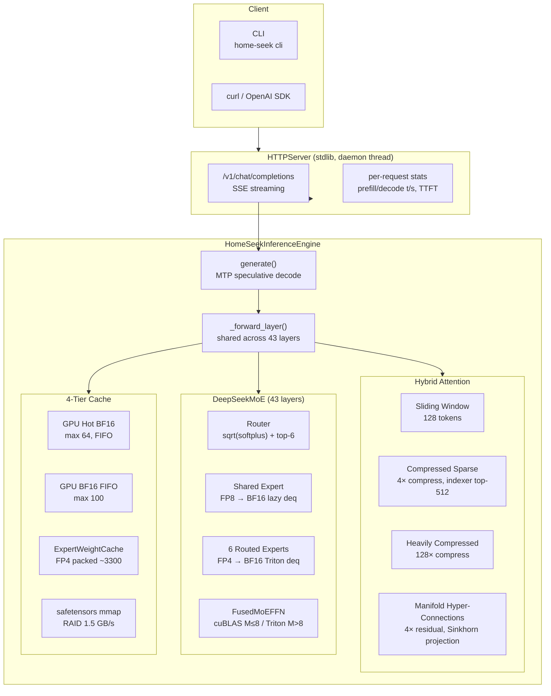
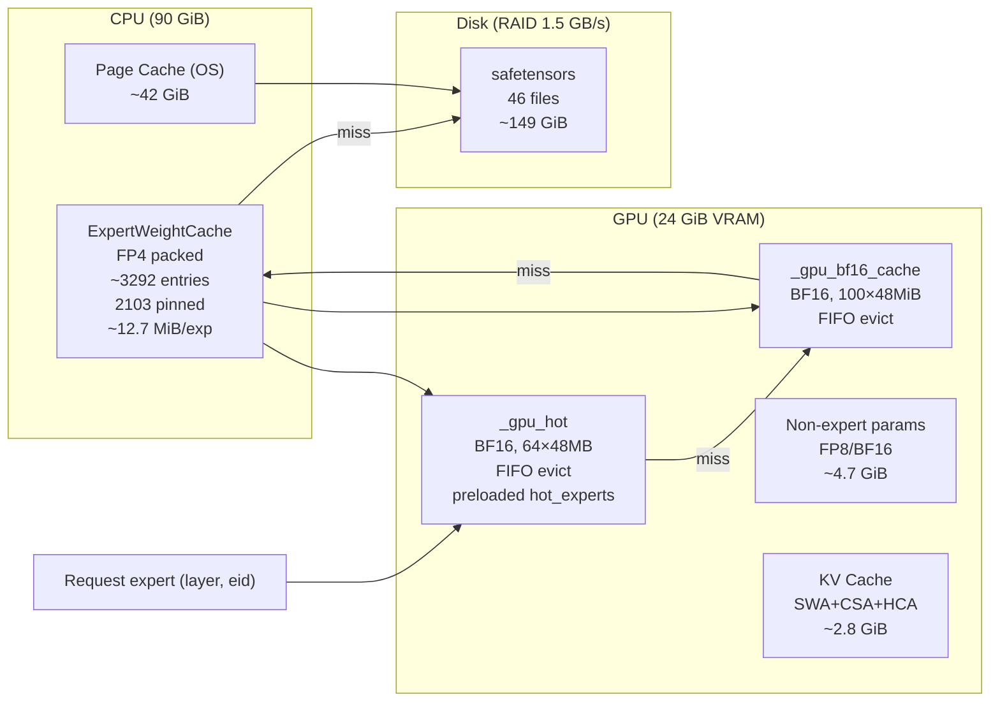

# Home-Seek

**DeepSeek-V4-Flash (284B MoE) Inference Engine — Single & Multi-GPU, Auto-Adapting**

[](LICENSE)

> **[中文版](README.md)** · [Introduction](#introduction) · [Architecture](#architecture-overview) · [Performance](#performance) · [Effective Optimizations](#effective-optimizations-) · [Ineffective Optimizations](#ineffective-optimizations-)

---

## Introduction

Home-Seek runs **DeepSeek-V4-Flash** — a 284B-parameter (13B active) MoE model with native million-token context support — on a **single NVIDIA RTX 4090 (24 GiB VRAM)**. Through a 4-tier cache hierarchy, custom Triton kernels, and MTP speculative decoding, it delivers usable inference performance on consumer hardware.

| Metric | Value |
|:---|---:|
| Decode (warm, single prompt) | **1.60 t/s** |
| Decode (warm, multi-prompt) | **1.55 t/s** |
| Prefill (warm, 5-8 tok) | **~2.0 t/s** |
| Peak GPU memory (PyTorch) | **~19.9 GiB** |
| Peak GPU memory (nvtop actual) | **~23 GiB** |
| CPU cache | ~42 GiB FP4 pinned |
| MTP eager (upper bound) | 5.96 t/s |
| MTP verified | 1.38 t/s |

[](https://asciinema.org/a/Cui1LDvCnfNQ6A51)

---

## Architecture Overview



### Inference Sequence


---

## Cache Hierarchy



Key: `(layer, eid)` | Per-expert: `I×D×51/32 ≈ 12.75 MiB` (FP4 data + f8 scale, ~12.7 MiB with scales)

---

## Model Weights & Memory

### Weight Breakdown

| Type | Size | Share | Precision | Details |
|:---|---:|---:|:---|:---|
| **Routed experts** (43×256 sets of w1/w2/w3) | **137 GiB** | 92% | FP4 int8 + f8 scale | ~13.4 MB/exp, dequantized to BF16 (48 MiB) at runtime |
| **Attention QKV/Wo** | 4.5 GiB | 3% | FP8 e4m3 | 17 tensors/layer: wq_a/b, wkv, wo_a/b, compressor, indexer |
| **Shared experts** (43 layers × 3 weights) | 1.0 GiB | 0.7% | FP8 e4m3 | GPU-resident, lazy deq to BF16 |
| **Embed + lm_head** (untied) | 2.0 GiB | 1.3% | BF16 | embed.weight + head.weight, each `[129280, 4096]` |
| **MTP experts** (256) | 3.2 GiB | 2.1% | FP4 int8 + f8 scale | CPU pinned, same format as main model |
| **MTP non-expert** (33 tensors) | 0.14 GiB | 0.1% | FP8 e4m3 + BF16 | attn QKV/Wo, e_proj, h_proj, norms, MHC |
| **FFN gate** | 0.09 GiB | 0.06% | BF16 | gate.weight `[256,4096]` × 43 layers |
| **Hash routing + MHC + norms** | 0.09 GiB | 0.06% | mixed | tid2eid int64, MHC float32, norms BF16 |
| **Total** | **~159 GB** | 100% | — | 46 safetensor files |
| **Total** | **~160 GB** | 100% | — | 46 safetensor files |

### Non-expert Weights Per Layer (118 MB/layer)

| Component | Size | Contents |
|:---|---:|:---|
| Attention QKV + Wo projections | 108.6 MB | wq_a/b, wkv, wo_a/b, q_norm, kv_norm, attn_sink |
| FFN gate + bias | 9.9 MB | gate.weight (BF16 `[256,4096]`), bias, tid2eid |
| Compressor (CSA/HCA) | part of attention | wkv, wgate, norm, ape |
| Indexer + compressor | part of attention | wq_b, weights_proj, wkv, wgate, norm, ape |
| MHC (global) | per-layer | hc_head_fn/base/scale (3 tensors) |

### Runtime Memory Map

```
GPU (24 GiB VRAM)
├── Non-expert weights (QKV/Wo/gate/norm/MHC)  ≈ 4.7 GiB  ← permanent
├── Shared experts (43 layers FP8 → lazy BF16)  ≈ 0.9 GiB  ← permanent
├── GPU hot expert cache (max 64 × 48 MiB (BF16 deq))  ≈ 2.8 GiB  ← FIFO
├── GPU BF16 FIFO cache (max 100 × 48 MiB)        ≈ 4.2 GiB
├── KV cache active window (32K tok)            ≈ 1.3 GiB  ← grows with context
├── MTP non-expert weights                      ≈ 0.3 GiB  ← permanent
├── CUDA context + misc                         ≈ 1.9 GiB
└── CUDA context + Triton cache + fragmentation  ≈ 2.9 GiB  ← visible in nvtop, not in PyTorch
   Total (PyTorch tracked)  ≈ 19.9 GiB
   Total (nvtop actual)     ≈ 23.0 GB

CPU (90 GiB RAM)
├── ExpertWeightCache FP4 (3292 entries)        ≈ 41 GiB  ← 2103 pinned + 1189 LRU
├── OS page cache (safetensors mmap)             ≈ 42 GiB  ← kernel-managed
├── KV archive (long context)                     ≤ 34 GiB  ← beyond 32K window
└── OS reserve                                     8 GB
```

### Context Length Support

| Factor | Limit | Reason |
|:---|---:|:---|
| **RoPE theoretical** | **1,048,576** | `max_position_embeddings`, YaRN scaling factor 16× |
| **GPU active window** | **32,768** | `LayerState.active_window=32768` (`layer_state.py:7`), auto-offloads beyond |
| **CPU archive capacity** | **~860,000** | 34 GiB available / 43 KB/tok (kv_latent 512×BF16 ×43 layers) |
| **Total practical** | **~900,000** | 32K GPU + 860K CPU, bounded by 90 GiB RAM |

Memory & time estimates at various context lengths:

| Context | GPU KV cache | CPU KV archive | Prefill est. time |
|:---|---:|---:|---:|
| 4K | 0.2 GiB | 0 | ~10s |
| 32K | 1.3 GiB | 0 | ~80s |
| 128K | 1.3 GiB | 3.8 GiB | ~5 min |
| 512K | 1.3 GiB | 19.2 GiB | ~20 min |
| 1M | 1.3 GiB | 38.4 GiB | ~40 min |

During prefill, all T tokens are processed in parallel through the FFN: each unique expert is loaded once and shared across all tokens routed to it (`_forward_ffn` L1101 → `_fused_moe.forward`). Total expert loads = O(layers × n_routed_experts) ≈ 11K, independent of T. The main cost is the serial 43-layer forward and the QKV/Wo large GEMMs.

> Note: prefill time estimates above are rough and exclude QKV/Wo projection and expert loading overhead.

---

## Performance

### Baseline (temperature=0, max-tokens=20, R2-R5 warm avg)

| Mode | Prefill t/s | Decode t/s | vs 1.54 | Condition |
|:---|:---:|---:|:---|---:|
| No MTP single prompt | 1.0 | 1.60 | — | "Hello" ×5 rounds |
| No MTP multi-prompt | ~2.0 | 1.54 | — | 5 different prompts |
| **GQA fusion** | ~2.0 | **1.57** | **+2%** | `--use-gqa-fusion`, within noise |
| MTP eager (skip verify) | ~2.0 | 5.96 | +287% | upper bound, not for production |
| **MTP verified** | ~2.0 | **1.38** | **−10%** | M=2, KV cache + fused verify |
| MTP verified (legacy) | ~2.0 | 0.96 | −38% | M=4, no KV cache, 2-stage verify

### Bottleneck Ranking (warm decode, R2-R5 avg, % of layer time)

| # | Bottleneck | per-token time | % of layer | Status |
|:---|---:|---:|---:|
| 1 | **FFN layer** (DMA + dequant + matmul) | ~430ms | 69% | ⚠ large GEMM dominated |
| 2 | **Attention layer** (QKV proj + attn + compress) | ~190ms | 31% | ⚠ file I/O ~90ms already reduced |
| | Layer subtotal | ~620ms | 100% | |
| | **Python dispatch** (outside layer) | ~40ms | — | ⚠ next target (CUDA graph partial) |
| | **MTP acceptance rate** | — | — | ⚠ ~38%, needs ~60% to break even |

---

## Effective Optimizations ✅

| Optimization | Gain | Details |
|:---|---:|:---|
| **CPU pinned memory** | +26% | `.pin_memory()` on FP4 entries during engine init. Eliminates DMA degradation to synchronous copy. Largest single win. |
| **FusedMoEFFN cuBLAS M≤8** | +1.9% | Triton 15/16 SM underutilized at M≤8; cuBLAS 8× faster (`fused_moe.py:297`). |
| **CPU cache ↔ page cache balance** | cold-start eliminated | `min(RAM/2, total_exp)` ≈ 45 GB cache + 45 GB page cache, avoids OS crowding. |
| **f8 scale kept as float8_e8m0fnu** | 4× memory | `_make_raw_entry` avoids fp32 conversion: 12.7 MiB/exp (vs 30 MB if fp32). |
| **Per-layer hot expert detection** | higher hit rate | `_all_routed_are_hot` per-layer replaces global set, more accurate coverage. |
| **Hot expert preloading** | fewer cold misses | Preloads per-layer hot experts from `hot_experts.json` into GPU FIFO at startup. |
| **MTP argmax (t=0)** | stable acceptance | Draft uses argmax when temperature=0, eliminating random noise. |
| **MTP KV cache + fused verify** | +44% (0.96→1.38) | Cross-step KV cache + `torch.cat` single forward |
| **4-tier cache hierarchy** | core architecture | CPU FP4 LRU + GPU hot FIFO + GPU BF16 FIFO + page cache, makes single-GPU 284B feasible |
| **HardwareConfig** | multi-hardware adaptation | Centralized config, 6 presets (`4090`/`a100`/`h20`/`rtx pro 6000`/`2080`/fallback), auto multi-GPU device_map |
| **KV cache CPU offload** | enables long context | Auto-offloads to CPU when VRAM exceeds `HardwareConfig.kv_offload_threshold_gb` |

---

## Ineffective Optimizations ❌

| Optimization | Reason Attempted | Failure Cause | Outcome |
|:---|---|:---|---|
| **GQA Attention fusion** (`--use-gqa-fusion`) | Eliminate 64× KV expand, save HBM | Attention matmul <5% of `_forward_attn`; hotspot is QKV/Wo projection GEMMs | **No throughput gain** (1.60→1.57, within noise). Flag retained, default off. |
| **MTP verified** (M=2) | Speculative decode speedup | ~38% acceptance rate, needs ~60% to offset 43-layer verification cost | **Slower than no-MTP** (1.38 vs 1.51). Weight reuse works, draft quality insufficient. |
| **CPU full preload** | Eliminate all file I/O | 11008×12.7 MiB = 169 GB crowds out page cache, +8% inference time | **Reverted to balanced strategy** ~42 GiB. |
| **Async DMA prefetch** | Overlap DMA + compute | CUDA stream overhead > benefit; FP4 dequant 0.04ms vs DMA 0.8ms, no overlap | **Disabled**, code moved to scripts/. |
| **GPU FP4 store** (legacy) | GPU-side FP4 expert cache | Same key/capacity/LRU as CPU cache, ~0% hit rate | **Removed** |
| **Shared expert cuBLAS fusion** | FP32 accumulation consistency | cuBLAS vs Triton accumulation order → routing noise ±20% | **Not usable for A/B comparison.** |
| **MHC_post Triton kernel** | Replace PyTorch fallback | Always raises AssertionError | **Falls back to PyTorch.** |
| **ExpertCacheManager** (expert_cache.py) | Unified 4-tier cache abstraction | engine.py duplicates cache independently, never wired in | **Half-finished**, profiler stats point to empty cache. |
| **Async expert prediction** (`predictor.predict`) | Predict next-layer experts from hidden state for prefetch | `collect()` records data but `predict()` is never called | **dead code**, data collected but unused |
| **Same-layer DMA∥compute pipeline** | Overlap expert DMA with current layer compute | FP4 dequant 0.04ms vs DMA 0.8ms, granularity mismatch | **inapplicable** |

---

## Key Design Decisions

### Why doesn't MTP verified speed things up?

```
MTP Eager (skip verify):  1 main fwd → generate 2 drafts → accept all = 3 tok/step → 5.96 t/s
MTP Verified:             1 main fwd → generate 2 drafts → verify all (43-layer fwd) → accept ~0.76 tok → 1.38 t/s
```

Verification requires a full 43-layer forward pass. At ~38% acceptance, verification overhead exceeds draft gains. The fundamental limit is the capability gap between the 1-layer MTP module and the 43-layer main model.

### Why doesn't GQA fusion speed things up?

| Operation | Share | FLOPs estimate |
|:---|---:|---:|
| QKV projection (3× GEMM) | ~50% | wq_a `[1024,4096]`, wq_b `[32768,1024]`, wkv `[512,4096]` |
| Wo projection (2× GEMM) | ~25% | wo_a `[1024,4096]`, wo_b `[4096,8192]` |
| KV compress + other | ~23% | compressor, RoPE, indexer |
| **Attention matmul** (target) | **~2%** | SDPA `[64,1,512] @ [512,T_kv]` — negligible |

### Roofline Analysis

```
M=1 decode matmul: [1,4096] × [16384,4096]
  Arithmetic intensity = FLOPs / bytes = 2×M×K×N / (K×N×2B) = M/2

M=1:  arithmetic intensity = 1.0  → HBM ceiling = 847 GB/s × 1.0 = 0.85 TFLOPS ✓
M=64: arithmetic intensity = 67   → HBM ceiling = 57 TFLOPS
```

M=1 decode matmul is HBM bandwidth-bound. More VRAM helps reduce DMA/IO (larger GPU cache), but decode speed is fundamentally capped by HBM bandwidth.

### Hardware Upgrade Cost-Benefit

| Option | Cost | Gain | Key Specs | Reason |
|:---|---:|---:|:---|:---|
| **Second 4090** (pipeline) | ~$1,800 | **~2× throughput** | VRAM: 24+24 GiB | Split 43 layers (0-21 / 22-42). Each GPU caches experts for half the layers → higher hit rate. PCIe P2P <1ms |
| **RTX 5090** | ~$2,000 | **~+60%** | VRAM: 32 GB, BW: ~1.8 TB/s | HBM bandwidth ~1.8× directly accelerates bandwidth-bound M=1 decode. 32GB holds ~330 experts (vs 164). Compute ~2× helps prefill and MTP verify |
| **RTX A6000** (48 GB) | ~$5,000 | **~+15%** | VRAM: 48 GB, BW: 768 GB/s | Bandwidth is LOWER than 4090 (768 vs 1008 GB/s). 48GB holds 500+ experts → minimal DMA/IO, but bandwidth-bound ops are slower — partial cancellation |
| **CPU upgrade** (faster DDR5) | ~$500 | **~+5%** | RAM bandwidth | DMA throughput bounded by CPU memory controller |
| **PCIe 5.0** | ~$1,000 | **~+3%** | 16→32 GB/s | Per-expert transfer is only 12.7 MiB, too small to benefit from doubled bandwidth |
| Local NVMe dedicated | N/A | — | already NVMe RAID | 1.7T ×3, model weights (150GB) already on NVMe |

---

## Quick Start

```bash
# Download weights (~150GB)
python -m home_seek download
# or: huggingface-cli download QingGo/Home-Seek --local-dir weights

# Install from source
git clone https://github.com/QingGo/home-seek.git
cd home-seek
make install

# Start server
make server

# Interactive CLI (another terminal)
make cli

# OpenAI-compatible API
curl http://localhost:8000/v1/chat/completions \
  -H "Content-Type: application/json" \
  -d '{"messages":[{"role":"user","content":"Hello"}],"max_tokens":50,"temperature":0}'

# Profiling
make profile

# Multi-round profiling
uv run python -m home_seek.profiling_runner --rounds 5 \
  --prompts "Hello" "What is AI?" "Write a poem" "How are you?" "Hi" \
  --max-tokens 20 --temperature 0
```

### CLI Commands
- `/think` — Toggle thinking mode
- `/stats` — Show last round stats
- `/help` — Help
- `/quit` — Quit

### API Response Stats
```json
{
  "stats": {
    "encoding_tokens": 5, "encoding_time_ms": 3040, "encoding_speed_tps": 1.6,
    "ttft_ms": 3040,
    "generated_tokens": 12, "decode_time_ms": 7810, "decode_speed_tps": 1.54
  }
}
```

---

## System Requirements

- **GPU**: NVIDIA RTX 4090 (24 GiB VRAM), CUDA 12+
- **RAM**: 90+ GB (container/VM)
- **Disk**: 150 GB (model weights)
- **OS**: Linux

---

## Project Structure

```
src/home_seek/
├── __main__.py                # CLI entry: download/server/cli
├── api_server.py              # HTTP server (stdlib, daemon thread)
├── inference_engine/          # Inference engine package
│   ├── engine.py              # HomeSeekInferenceEngine
│   ├── weight_loader.py       # WeightLoader + FP4/FP8 load functions
│   ├── layer_state.py         # LayerState (per-layer KV state)
│   └── expert_cache.py        # ExpertWeightCache + ExpertCacheManager
├── fused_moe.py               # FusedMoEFFN + SharedExpertFFN (Triton + cuBLAS)
├── gqa_attention.py           # [EXPERIMENTAL] GQA fused attention kernel
├── router.py                  # MoE routing (sqrt(softplus)+topk)
├── compressor.py              # KV compression (CSA/HCA)
├── hybrid_kv_cache.py         # Hybrid KV Cache (SWA+CSA+HCA)
├── lightning_indexer.py       # Lightning Attention indexer
├── mhc.py                     # MHC Sinkhorn split
├── model_config.py            # @dataclass configuration
├── _fp4.py                    # FP4 quantize/dequantize reference
├── profiling_runner.py        # Profiling entry point
├── expert_predictor.py        # Expert prediction (HeuristicPredictor)
├── hw_profile.py              # Hardware performance probing
├── hardware_config.py         # HardwareConfig — centralized hardware parameters
└── encoding_dsv4.py           # Message encoding (DeepSeek V4 format)

tests/
├── conftest.py                # Triton warmup + CUDA skip
├── _reference.py              # Reference implementations for tests
├── _engine_stub.py            # EngineStub for test construction
├── test_fixes.py, test_fp4_experts.py, test_mtp.py, ...
└── integration/
    └── test_inference_e2e.py  # End-to-end regression tests
```

---

## Design Discipline

1. **Write a reproducer test first**: L1 test must be <1s and pinpoint the bug.
2. **`make profile` to validate perf changes**: `--temperature 0` eliminates routing noise, average 3+ runs.
3. **Pass `make lint test-unit` before committing**: ruff static analysis + unit tests.
4. **Clear Triton cache after kernel changes**: `rm -rf ~/.triton/cache/`.
5. **`_forward_layer` shared method**: All layer forward passes go through this method, never copy-paste.

---

## License

MIT
