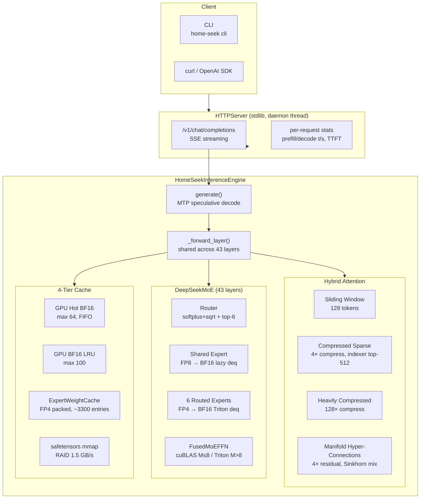
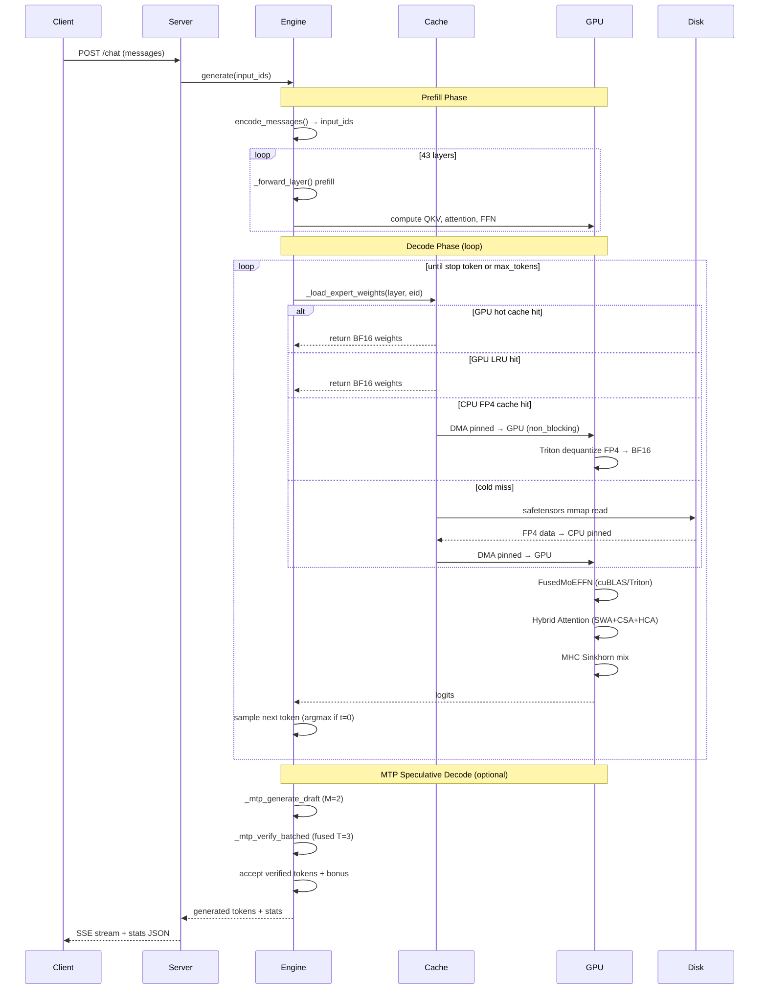

# Home-Seek

**DeepSeek-V4-Flash (284B MoE) Inference Engine on a Single RTX 4090**

[](LICENSE)

> **[中文版](README.md)** · [Introduction](#introduction) · [Architecture](#architecture-overview) · [Performance](#performance) · [Effective Optimizations](#effective-optimizations-) · [Ineffective Optimizations](#ineffective-optimizations-)

---

## Introduction

Home-Seek runs **DeepSeek-V4-Flash** — a 284B-parameter (13B active) MoE model with native million-token context support — on a **single NVIDIA RTX 4090 (24 GB VRAM)**. Through FP4 quantization, a three-tier cache hierarchy, custom Triton kernels, and MTP speculative decoding, it delivers usable inference performance on consumer hardware.

| Metric | Value |
|:---|---:|
| Decode (warm, single prompt) | **1.60 t/s** |
| Decode (warm, multi-prompt) | **1.55 t/s** |
| Prefill (warm, 5-8 tok) | **~2.0 t/s** |
| TTFT (warm) | **~3.4 s** |
| Peak GPU memory | **19.9 GB** |
| CPU cache | ~45 GB FP4 pinned |
| MTP eager (upper bound) | 5.96 t/s |
| MTP verified | 1.38 t/s |

[](https://asciinema.org/a/Cui1LDvCnfNQ6A51)

---

## Architecture Overview



### Inference Sequence



---

## Cache Hierarchy


Key: `(layer, eid)` | Per-expert: `I×D×51/32 ≈ 12.75 MB` (FP4 data + f8 scale)

---

## Performance

### Baseline (temperature=0, max-tokens=20, R2-R5 warm avg)

| Mode | Prefill t/s | Decode t/s | vs 1.54 | Condition |
|:---|:---:|---:|:---|---:|
| No MTP single prompt | 1.0 | 1.60 | — | "Hello" ×5 rounds |
| No MTP multi-prompt | ~2.0 | 1.54 | — | 5 different prompts |
| **GQA fusion** | ~2.0 | **1.57** | **+2%** | `--use-gqa-fusion`, within noise |
| MTP eager (skip verify) | ~2.0 | 5.96 | +287% | upper bound, not for production |
| **MTP verified** | ~2.0 | **1.38** | **−10%** | M=2, KV cache + fused verify |
| MTP verified (legacy) | ~2.0 | 0.96 | −38% | M=4, no KV cache, 2-stage verify

### Bottleneck Ranking (warm decode, R2-R5 avg)

| # | Bottleneck | per-token time | Share | Status |
|:---|---:|---:|---:|
| 1 | **FFN layer** (DMA + dequant + matmul) | ~430ms | 69% | ⚠ includes file I/O |
| 2 | **Attention layer** (QKV proj + attn + compress) | ~190ms | 30% | ⚠ dominated by large GEMMs |
| 3 | of which: **File I/O** (page cache) | ~90ms | 14% | ⬇ greatly reduced (cold 4.5ms→warm 1.0ms/load) |
| 4 | **MTP acceptance rate** | — | — | ⚠ ~38%, needs ~60% to break even |
| 5 | **Python dispatch** | ~40ms | 6% | ⚠ next target (CUDA graph partial) |

---

## Effective Optimizations ✅

| Optimization | Gain | Details |
|:---|---:|:---|
| **CPU pinned memory** | +26% | `.pin_memory()` on FP4 entries during engine init. Eliminates DMA degradation to synchronous copy. Largest single win. |
| **FP4 quantization** | — | Routed experts FP4 (E2M1), 12.75 MB/exp vs 48MB BF16, 4× memory savings. |
| **FusedMoEFFN cuBLAS M≤8** | +1.9% | Triton 15/16 SM underutilized at M≤8; cuBLAS 8× faster (`fused_moe.py:297`). |
| **CPU cache ↔ page cache balance** | cold-start eliminated | `min(RAM/2, total_exp)` ≈ 45 GB cache + 45 GB page cache, avoids OS crowding. |
| **f8 scale kept as float8_e8m0fnu** | 4× memory | `_make_raw_entry` avoids fp32 conversion: 12.75 MB/exp (vs 30 MB if fp32). |
| **Per-layer hot expert detection** | higher hit rate | `_all_routed_are_hot` per-layer replaces global set, more accurate coverage. |
| **Hot expert preloading** | fewer cold misses | Preloads per-layer hot experts from `hot_experts.json` into GPU FIFO at startup. |
| **MTP argmax (t=0)** | stable acceptance | Draft uses argmax when temperature=0, eliminating random noise. |
| **MTP KV cache + fused verify** | +44% (0.96→1.38) | Cross-step KV cache + `torch.cat` single forward |
| **Thread-safe ExpertWeightCache** | multi-thread stability | `put()` wraps KeyError for concurrent eviction |
| **MTP expert scale float32** | fixes 0% acceptance | Triton dequantize doesn't support float8_e8m0fnu. |
| **Stop token detection** | prevents garbage output | Reads true `</｜end▁of▁sentence｜>` token 1 from `tokenizer.json`. |

---

## Ineffective Optimizations ❌

| Optimization | Reason Attempted | Failure Cause | Outcome |
|:---|---|:---|---|
| **GQA Attention fusion** (`--use-gqa-fusion`) | Eliminate 64× KV expand, save HBM | Attention matmul <5% of `_forward_attn`; hotspot is QKV/Wo projection GEMMs | **No throughput gain** (1.60→1.57, within noise). Flag retained, default off. |
| **MTP verified** (M=2) | Speculative decode speedup | ~38% acceptance rate, needs ~60% to offset 43-layer verification cost | **Slower than no-MTP** (1.38 vs 1.51). Weight reuse works, draft quality insufficient. |
| **CPU full preload** | Eliminate all file I/O | 11008×12.75 MB = 169 GB crowds out page cache, +8% inference time | **Reverted to balanced strategy** ~45 GB. |
| **Async DMA prefetch** | Overlap DMA + compute | CUDA stream overhead > benefit; FP4 dequant 0.04ms vs DMA 0.8ms, no overlap | **Disabled**, code moved to scripts/. |
| **GPU FP4 store** (legacy) | GPU-side FP4 expert cache | Same key/capacity/LRU as CPU cache, ~0% hit rate | **Removed** |
| **Shared expert cuBLAS fusion** | FP32 accumulation consistency | cuBLAS vs Triton accumulation order → routing noise ±20% | **Not usable for A/B comparison.** |
| **MHC_post Triton kernel** | Replace PyTorch fallback | Always raises AssertionError | **Falls back to PyTorch.** |
| **ExpertCacheManager** (expert_cache.py) | Unified 4-tier cache abstraction | engine.py duplicates cache independently, never wired in | **Half-finished**, profiler stats point to empty cache. |
| **mypy type checking** | Type safety | mypy not installed in project | **Deprecated** `make typecheck`. |

---

## Key Design Decisions

### Why doesn't MTP verified speed things up?

```
MTP Eager (skip verify):  1 main fwd → generate 2 drafts → accept all = 3 tok/step → 5.96 t/s
MTP Verified:             1 main fwd → generate 2 drafts → verify all (43-layer fwd) → accept ~0.76 tok → 1.38 t/s
```

Verification requires a full 43-layer forward pass. At ~38% acceptance, verification overhead exceeds draft gains. The fundamental limit is the capability gap between the 1-layer MTP module and the 43-layer main model.

### Why doesn't GQA fusion speed things up?

| Operation | Share | FLOPs estimate |
|:---|---:|---:|
| QKV projection (3× GEMM) | ~50% | wq_a `[1024,4096]`, wq_b `[32768,1024]`, wkv `[512,4096]` |
| Wo projection (2× GEMM) | ~25% | wo_a `[1024,4096]`, wo_b `[4096,8192]` |
| KV compress + other | ~23% | compressor, RoPE, indexer |
| **Attention matmul** (target) | **~2%** | SDPA `[64,1,512] @ [512,T_kv]` — negligible |

### Roofline Analysis

```
M=1 decode matmul: [1,4096] × [16384,4096]
  Arithmetic intensity = FLOPs / bytes = 2×M×K×N / (K×N×2B) = M/2

M=1:  arithmetic intensity = 1.0  → HBM ceiling = 847 GB/s × 1.0 = 0.85 TFLOPS ✓
M=64: arithmetic intensity = 67   → HBM ceiling = 57 TFLOPS
```

M=1 decode matmul is HBM bandwidth-bound. Hardware upgrades (e.g. 48GB VRAM) yield diminishing returns.

### Hardware Upgrade Cost-Benefit

| Option | Cost | Gain | Reason |
|:---|---:|---:|:---|
| Second 4090 (pipeline) | ~$1,800 | +100% throughput | Dual GPU = 2× throughput. |
| Local NVMe | $0 | +5% | File I/O not primary bottleneck. |
| 48GB VRAM GPU | ~$5,000 | +5% | M=1 utilization unchanged. |

---

## Quick Start

```bash
# Download weights (~150GB)
python -m home_seek download
# or: huggingface-cli download QingGo/Home-Seek --local-dir weights

# Install from source
git clone https://github.com/QingGo/home-seek.git
cd home-seek
make install

# Start server
make server

# Interactive CLI (another terminal)
make cli

# OpenAI-compatible API
curl http://localhost:8000/v1/chat/completions \
  -H "Content-Type: application/json" \
  -d '{"messages":[{"role":"user","content":"Hello"}],"max_tokens":50,"temperature":0}'

# Profiling
make profile

# Multi-round profiling
uv run python -m home_seek.profiling_runner --rounds 5 \
  --prompts "Hello" "What is AI?" "Write a poem" "How are you?" "Hi" \
  --max-tokens 20 --temperature 0
```

### CLI Commands
- `/think` — Toggle thinking mode
- `/stats` — Show last round stats
- `/help` — Help
- `/quit` — Quit

### API Response Stats
```json
{
  "stats": {
    "encoding_tokens": 5, "encoding_time_ms": 7952, "encoding_speed_tps": 0.6,
    "ttft_ms": 7952,
    "generated_tokens": 9, "decode_time_ms": 6255, "decode_speed_tps": 0.8
  }
}
```

---

## System Requirements

- **GPU**: NVIDIA RTX 4090 (24 GB VRAM), CUDA 12+
- **RAM**: 90+ GB (container/VM)
- **Disk**: 150 GB (model weights)
- **OS**: Linux

---

## Project Structure

```
src/home_seek/
├── inference_engine/          # Inference engine package
│   ├── engine.py              # HomeSeekInferenceEngine
│   ├── weight_loader.py       # WeightLoader + FP4/FP8 load functions
│   ├── layer_state.py         # LayerState (per-layer KV state)
│   └── expert_cache.py        # ExpertWeightCache + ExpertCacheManager
├── fused_moe.py               # FusedMoEFFN + SharedExpertFFN (Triton + cuBLAS)
├── gqa_attention.py           # [EXPERIMENTAL] GQA fused attention kernel
├── router.py                  # MoE routing
├── compressor.py              # KV compression
├── hybrid_kv_cache.py         # Hybrid KV Cache (SWA+CSA+HCA)
├── mhc.py                     # MHC Sinkhorn split
├── model_config.py            # @dataclass configuration
├── _fp4.py                    # FP4 quantize/dequantize utilities
├── profiling_runner.py        # Profiling entry point
└── expert_predictor.py        # Expert prediction

tests/
├── test_fixes.py, test_fp4_experts.py, test_mtp.py, ...
└── integration/
    └── test_inference_e2e.py  # End-to-end regression tests
```

---

## Design Discipline

1. **Write a reproducer test first**: L1 test must be <1s and pinpoint the bug.
2. **`make profile` to validate perf changes**: `--temperature 0` eliminates routing noise, average 3+ runs.
3. **Pass `make lint test-unit` before committing**: ruff static analysis + unit tests.
4. **Clear Triton cache after kernel changes**: `rm -rf ~/.triton/cache/`.
5. **`_forward_layer` shared method**: All layer forward passes go through this method, never copy-paste.

---

## License

MIT
